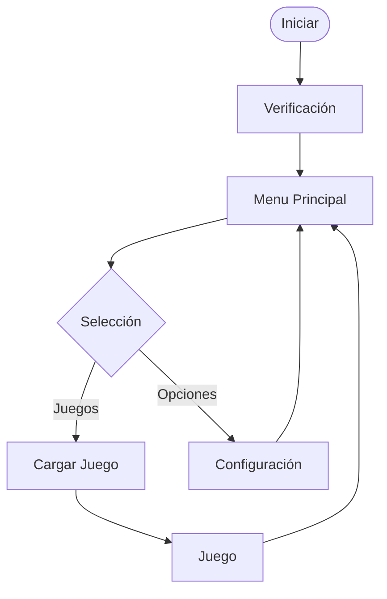

# Proyecto Consola Digital - Arquitectura y Flujo

Este repositorio contiene la arquitectura de hardware para el desarrollo de una consola interactiva, basada en la integración de módulos periféricos y de procesamiento.

## Diagrama de Flujo Principal

El sistema se divide en tres estados principales: Verificación, Menu principal y Juego.

## Verificaciones del sistema al encender

Al encender el sistema, se ejecuta un diagnóstico de hardware y se carga la secuencia una intro tipo ps3.

[Ejemplo](https://www.youtube.com/watch?v=Ywh-aIfEcew)

La idea es que mientras se este ejecutando esta intro, se ejecuten test de todos los modulos:

- Diagnóstico de Memoria: Verificación rápida de lectura/escritura en BRAM 

- Test de Periféricos: Detección de entradas conectadas mediante los controladores PS/2

- Inicialización A/V: Configuración de hardware externo vía I2C (Grupo H) y test de salidas de video/audio (Grupos J, I).

## Menu Principal y Configuracion

Interfaz de usuario en estado de espera para seleccionar juegos o ajustar parámetros de la consola.

[insertar aca imagen menu]

Interfaz Gráfica: Renderizado de menú estático a cargo del display driver (Grupo J).

Navegación: El controlador PS/2 (Grupo E) decodifica las pulsaciones del usuario para mover el cursor y seleccionar opciones.

Ajustes: Modificación de parámetros físicos (ej. brillo, volumen) transmitidos a la placa mediante I2C (Grupo H).

## Juego (Game Loop)
Ejecución continua del juego seleccionado, requiriendo sincronización estricta entre lectura de periféricos y renderizado.

Carga de Datos: Extracción de recursos desde la memoria Flash (Grupo D) hacia la RAM (Grupo C) para acceso rápido.

Lógica Principal: Procesamiento de reglas, físicas y colisiones administrado por el módulo de software central (Grupo K).

Input sin Latencia: Lectura ininterrumpida de acciones del jugador a través del teclado/mouse/mando (Grupos E, F, G).

Salida Sincronizada: Actualización constante de video a 60Hz (Grupo J) y emisión de efectos de sonido I2S (Grupo I).
